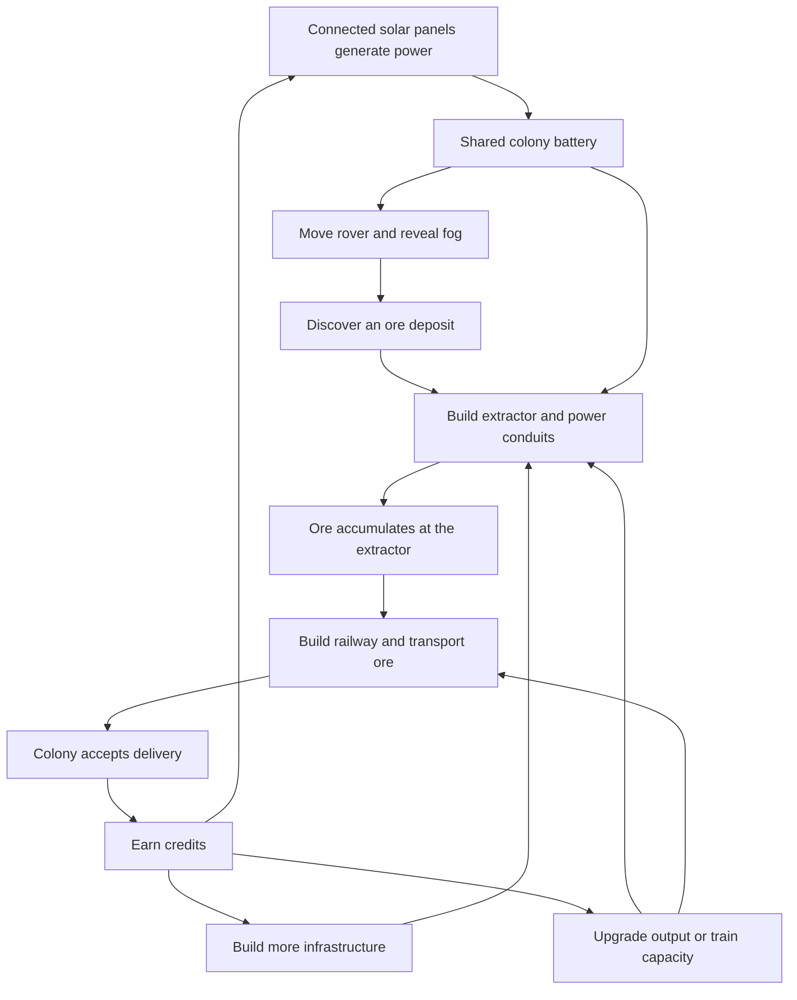

# Astra Express Game Design Document

Version 0.5 · 13 September 2026 · Pre-event implementation authorized

The current 90-minute implementation commitment is defined in [Pre-event milestone](PRE_EVENT_MILESTONE.md). It deliberately implements a subset of this full-game design and protects a further 30-minute buffer.

## Game concept

We explore a fog-covered alien landscape with a rover, discover ore deposits, and build a mining railway around an initial colony. Solar panels generate the power needed to explore and operate extractors. Conduits connect extractors to the electrical network; tracks and trains bring their output home. Delivered ore earns credits that fund new infrastructure and upgrades.

The experience combines Lucky Space's exploration and developing colony with Transport Tycoon's transport network and reinvestment. The player's work changes the landscape from an isolated outpost into a connected industrial settlement.

This revision replaces the earlier fixed-industry, refinery, food, and gate scenario. Those systems are possible later additions, not requirements for the current game. The immediate objective is to discover a deposit and establish a working, paying extraction route, then expand.

## Confirmed direction

- Most of the map starts under fog; only a small area around the colony is visible.
- The player moves a rover by clicking a destination. Movement consumes power and clears surrounding fog.
- One starting solar installation regenerates power. More panels increase generation speed.
- Discovered ore patches support resource extractors.
- The world uses a square grid. Low-yield 1 by 1 deposits lie near the colony, higher-yield 2 by 2 deposits farther away, and the highest-yield 3 by 3 deposits in more distant areas.
- All resource deposits are infinite. Exploration unlocks higher production rates while established mines remain useful indefinitely.
- Extractors must connect to the solar and colony electrical network through power conduits.
- A shared colony battery supplies rover movement and ongoing extractor consumption.
- Pausing extractors reduces demand and allows the battery to recover.
- Tracks and trains transport extracted ore back to the colony. Deliveries earn credits.
- Credits purchase panels, extractors, conduits, track, and train-capacity and extractor-output upgrades.
- A fictional fuel resource can be extracted and shipped by train to a power plant, where it is consumed to generate substantially more power than solar panels. The resource name and balance remain provisional; this chain follows the first ore-delivery checkpoint.
- Use the supplied Kenney Space Kit and City Kit Industrial. Solar installations use solar-panel-landscape-group.fbx from the industrial pack.

The user and teammate own gameplay and art-direction review. They may provide asset packs and suggest lighting and shader changes. The assistant owns implementation, integration, debugging, and validation after planning is complete.

Rules explicitly labelled as proposed below remain design recommendations. In particular, starting quantities, remote rover charging, fog persistence, and balance values are not yet approved requirements. The pre-event checkpoint uses documented defaults so implementation can proceed while the user travels.

## Core loop

Exploration reveals opportunities. Power makes them productive. Rail transport makes them profitable. A powered extractor can produce ore while earning nothing because its output has no transport service.

The important decisions are where to explore, which deposit justifies its connection cost, how much generation to add, and whether extraction or transport is limiting income. The interface should show these relationships directly.

## Exploration and rover

### World and fog

Propose one authored 32 by 24 tile map with several deposits and meaningful connection distances. The first 1 by 1 deposit sits just beyond the initial reveal area on a guaranteed reachable route. Place 2 by 2 deposits farther out and 3 by 3 deposits in the distant frontier, so extending exploration and infrastructure reveals progressively more productive sites. Keep the exact map dimensions provisional until all three tiers fit with useful routes and building clearance.

### Deposit tiers

| Patch footprint | Relative location | Base yield | Role in progression |
| --- | --- | --- | --- |
| 1 by 1 | Near the colony | Low | Affordable first extraction route and early income |
| 2 by 2 | Farther from the colony | Higher | Expansion that rewards more power and transport capacity |
| 3 by 3 | Distant frontier | Highest | Major industrial site that justifies a longer railway |

Yield means production rate: a larger deposit produces more ore per unit of powered operating time at the same extractor upgrade level. Every tier has infinite supply, while extraction rate, available power, local storage, and transport capacity limit realized income. Exact output, purchase price, storage, and power demand for each tier remain tuning decisions. Tile area does not automatically imply production multipliers of four and nine.

Judge distance using practical exploration and connection routes, including terrain obstacles. Preserve an affordable first route, and leave room around larger patches for building ports, tracks, and conduits. Later deposits should offer enough potential income to justify their longer connections when suitable generation and train capacity are installed.

### Fog visibility

Proposed fog behaviour: revealed tiles remain visible permanently. The player can inspect and build on previously explored terrain after the rover leaves. Continuous line of sight and re-covering explored terrain are unnecessary for the initial loop.

Fog conceals terrain details, deposits, labels, selection targets, and their shadows. Placement snapping, route previews, and any future minimap must not reveal hidden resources. Revealing one edge of a larger patch exposes only its revealed cells; keep its full footprint, tier label, and yield hidden until the entire deposit has been explored. Use a soft boundary and a short reveal animation as the rover advances.

### Movement and charging

In Explore mode, a left click sets the rover's destination. The rover follows walkable terrain and consumes power in proportion to distance actually travelled. A cancelled move, unreachable destination, or stationary rover must not spend movement energy.

Clicking into fog sets an exploration destination. Plan toward a reachable frontier using known terrain, reveal the next area, and replan as needed. Do not expose a full route through hidden obstacles. If no continuation exists, stop and explain why. Tracks and conduits are traversable; building footprints and major terrain obstacles block movement.

At zero power, pause the movement order and resume when power is available. Proposed default: the rover uses the shared regenerating budget wherever it is, so it need not return to the colony to recharge. This makes a depleted battery recoverable without a rescue mechanic.

Provide camera pan, zoom, Centre on Rover, and Centre on Colony. Keep camera rotation fixed for a consistent isometric view.

## Power system

### Shared battery

Every solar installation connected to the colony adds generation to one shared battery. Rover movement and active connected extractors consume stored power. More panels increase generation rate; battery capacity stays fixed initially.

Show current charge, capacity, generation per second, extractor demand, and net change. Before buying or upgrading an extractor, preview its additional demand.

Proposed shortage policy: protect a small reserve from automatic extraction and give rover movement priority. Extractors pause below the reserve and display Low power. The player can pause individual machines to recover faster. Allocate limited power fairly across operating extractors rather than always starving the last-built machine. Mining progress advances only for work actually supplied with power.

Proposed recovery guarantee: the starter panel is attached directly to the colony and cannot be demolished. It always offers a way to regenerate power. There is no night cycle, panel degradation, or ongoing train energy cost in the initial release. A train can still deliver stored ore while the battery is empty.

### Conduits and connectivity

Propose the colony as the electrical network hub. Conduits connect cardinally adjacent tiles to explicit building power ports. A panel contributes only when its connection reaches the colony; an extractor can draw power only when its connection reaches that same network. Independent power islands are outside this first model.

Electrical connectivity and rail connectivity are separate. Track never transmits power. A corridor may hold both conduit and track, with their meshes drawn separately. They have independent costs and removal actions.

Recalculate the electrical graph after construction or demolition. A Power overlay highlights connected lines and buildings. Removing a conduit previews which buildings will lose their connection. Disconnection stops future mining work and preserves production progress and stored ore.

### Fuel-fired generation: subsequent milestone

Use a second infinite resource, provisionally named Fluxite. Its powered extractor stores fuel locally; a train transports it to a power plant rather than selling it as ore at the colony. A conduit-connected plant consumes its local fuel inventory over time and contributes generation to the same shared battery. Delivery is not a permanent generation upgrade: sustained output requires sustained fuel shipments. Resource type and deposit footprint are separate properties.

Proposed recovery rules: solar bootstraps fuel extraction, trains do not require battery power, and a connected fueled plant can restart with an empty shared battery. Keep solar useful as a dependable baseline when fuel delivery stops. Pause fuel consumption when no generation is needed, retain any partly used burn cycle, and show plant fuel stock, supply warnings, and generation separately from solar. Fuel consumed by a plant earns no delivery credits in the initial fuel-chain design. Exact plant footprint, price, buffer, burn rate, and output are still tuning decisions. Track fuel produced, stored, transported, and consumed independently of ore sold.

## Construction and extraction

Construction requires revealed terrain. Proposed default: the rover does not need to stand beside every construction site. Exploration unlocks an area for building without requiring a second trip for every structure.

| Structure | Placement | Function |
| --- | --- | --- |
| Colony | Fixed starting site | Shared battery, power hub, ore buyer, train depot |
| Solar installation | Revealed clear terrain | Adds generation when connected |
| Extractor | Valid fully revealed 1 by 1, 2 by 2, or 3 by 3 ore patch | Mines at the patch tier's base yield, modified by output upgrades |
| Conduit | Revealed traversable tile | Connects electrical ports |
| Track | Revealed traversable tile | Connects loading ports to the colony depot |

Use grid-aligned footprints, explicit connection ports, and building rotation. Proposed extractor rule: each deposit is one mining site with one extractor installation occupying the matching 1 by 1, 2 by 2, or 3 by 3 footprint. All deposit cells must be revealed, valid, and unoccupied before construction; claim the entire footprint atomically to prevent overlapping installations or multiple extractors counting the same deposit yield. Patch size is intrinsic to the deposit and does not change when its extractor is upgraded.

The colony includes its depot and extractors include loading ports, avoiding an extra station purchase in the first version. Keep power and rail ports on accessible footprint edges, with decorative platform details inside the declared footprint. A placement preview shows the footprint, ports, price, base output, power demand, validity, and connection state before committing. Matching extractor footprints are proposed and can be revised independently of the confirmed deposit sizes.

An extractor can be placed before its power line or railway is complete. Its panel shows Powered, Railway connected, and Train assigned as separate conditions. Also show deposit tier, local ore inventory, output rate, and upgrade level. Deposits do not have a remaining-reserves counter.

Ore stays at the extractor until a train loads it. Full storage pauses mining. A power interruption preserves partial progress. Output upgrades affect future work and increase power demand; purchasing one does not instantly create ore or credits.

Deposits never run out. The first small mine can keep funding expansion while the rover searches for more productive sites. Farther deposits offer greater throughput in exchange for exploration, longer connections, and supporting generation and train capacity. The player expands to improve income rather than to replace exhausted deposits. Balance upgrades and site tiers so a nearby mine remains useful and a well-supported distant mine offers a worthwhile increase in income.

## Rail transport

Lay orthogonal track on explored terrain, with a clear total price before confirmation. Prototype short drags or start-and-end previews, then choose the more usable input method. Reusing existing track is free. Invalid or unaffordable placement charges nothing.

Select an extractor, assign an available train, and start a service only when a continuous rail path reaches the colony depot. The train loads, travels home, unloads, returns empty, and repeats. Begin with two-stop services and a small fleet. Multi-stop schedules can follow later.

Train capacity caps each load. Show ore visually and numerically, with Waiting for ore, Loading, Delivering, and Returning states. After a short loading dwell, a train can depart with a partial load; with no cargo it waits instead of running empty services.

The colony accepts and sells ore immediately. Remove unloaded cargo and award its payment once. Extraction, loading, empty travel, reconnecting a service, and repeated UI events do not award credits.

Trains may share track and pass each other initially. Signals, collisions, reservations between competing trains, and congestion simulation are deferred. Capacity upgrades apply at the next loading stop and preserve cargo already aboard.

Block removal of track used by an active service. Cancellation or reassignment takes effect after the current delivery and return to the colony. An idle, empty train can be sold. These restrictions prevent track editing from stranding paid-for equipment or deleting cargo.

## Economy and starting balance

Start with a colony, rover, one solar installation, credits, and a free small train. The starter panel is confirmed; the remaining equipment and all amounts below are proposed to make the first route accessible.

| Parameter | Proposed initial value |
| --- | --- |
| Credits | 500 |
| Battery capacity and starting charge | 100 power |
| Solar generation | 2 power per second per connected installation |
| Solar installation cost | 100 credits |
| Rover movement | 2 power per tile, up to 2 tiles per second |
| Colony and rover reveal radii | 4 tiles and 3 tiles |
| Starter 1 by 1 extractor cost | 150 credits |
| Starter 1 by 1 extractor output | 1 ore every 2 seconds |
| Starter 1 by 1 extractor power consumption | 1 power per second while working |
| Starter 1 by 1 extractor storage | 24 ore |
| 2 by 2 and 3 by 3 base output | Progressively higher than the starter tier; exact rates to be tuned |
| Larger extractor cost, storage, and power demand | Tier-specific values to be tuned with connection length and train capacity |
| Conduit and track costs | 2 and 3 credits per new tile |
| Train capacity and speed | 4 ore and 2 tiles per second |
| Loading and unloading dwell | 1 second each |
| Additional train cost | 150 credits |
| Ore sale value | 8 credits per delivered unit |
| Train capacity upgrades | 4 to 8 for 100 credits; 8 to 12 for 200 |
| Extractor output upgrades | Proposed multipliers of 1x, 2x, and 3x the patch's base output |
| Starter-tier upgrade costs and power demand | 120 then 240 credits; 2 then 3 power per second respectively |
| Battery reserve protected from extraction | 10 power |

These are tuning inputs, not measured balance.

A starter 1 by 1 extractor plus eight new rail tiles and eight conduit tiles costs 190 credits, leaving 310. At eight credits per ore, 24 delivered ore covers that investment. The authored first route must actually fit this budget.

A six-tile one-way service takes about eight seconds per round trip including both dwells. At four ore per full load it could carry 30 ore per minute, matching the starter extractor's theoretical output. Longer routes, larger deposits, and upgraded extraction create a reason to increase capacity. Actual throughput depends on loading, path length, available power, and inventory. Tune larger-site output together with train upgrades and fleet size so at least one affordable service arrangement can transport it; do not assign large multipliers without checking the resulting throughput.

One panel and one starter extractor leave one power per second for battery recovery while the rover rests. Moving at full speed consumes four power per second. Another panel adds two generation per second; an extractor upgrade adds demand. Investment decisions therefore affect both exploration speed and income.

Propose full refunds for recoverable purchases during the prototype, including paid upgrade costs when selling the upgraded item. Empty an extractor before demolition, and complete cargo deliveries before retiring a train or its route. Protect the starter panel. This allows players to recover from poor spending without creating or destroying cargo.

There is no debt, upkeep, death timer, or automatic failure at zero power. Pausing machines, refunding eligible purchases, and starter-panel regeneration must provide a path forward.

## Progression and interface

Guide the player through a nearby 1 by 1 discovery, extractor placement, power connection, rail construction, first payment, and an upgrade. Later exploration reveals a 2 by 2 opportunity and eventually a 3 by 3 frontier site. Celebrate these steps with concise prompts and small world effects. A completion card for the first profitable route can invite continued play; a gate or campaign finale is not required at this stage.

Provisional pacing targets are a first discovery in 30 to 60 seconds and first paid delivery in 2 to 3 minutes. Tune starting charge, fog radii, deposit distance, and tutorial together.

| Screen area | Content |
| --- | --- |
| Top bar | Credits, battery, generation and demand, Pause, Sound |
| Objective panel | Next task without exposing hidden deposits |
| Selection panel | Rover order, building connections, inventory, production, upgrades, train cargo |
| Build toolbar | Explore, Solar, Extractor, Conduit, Track, Remove |
| Map controls | Power and rail overlays, pan, zoom, centre on rover or colony |

Explore mode moves the rover when terrain is clicked; clicking a visible object selects it. Build mode clearly changes the click action to construction. Right click or Escape cancels a preview. UI input must not also affect the world underneath.

Keep controls readable at 1280 by 720. Use icons and names with colour. Low power, Disconnected, Storage full, and No train assigned are distinct conditions with different remedies.

## Art direction and collaboration

Use a low-poly isometric landscape with soft exploration fog. Give the rover character through its silhouette, wheels, antenna, headlights, and discovery response. Panel surfaces, moving drills, illuminated conduits, loaded trains, and delivery effects show the network working.

The user and teammate refine gameplay and art direction, suggest or provide asset packs, and review lighting and shaders. The assistant implements and integrates those choices, measures performance, fixes defects, and maintains the playable build. Review the first rover-and-fog scene and the first complete mining route before multiplying assets or polishing the whole map.

The required set is colony, rover, solar panels, ore patch, extractor, conduits, track, and train. Refinery, food, alloy, greenhouse, and gate art are deferred. See the revised [asset brief](ASSET_BRIEF.md).

Choose fog and lighting that work in the actual browser. Prefer an exploration mask and soft material edge over expensive volumetric effects. Hidden objects must not leak through lights, shadows, effects, or selection.

## Technical approach

Use the existing Unity 6000.3.24f1 URP project and installed Web Build Support. The local Unity bridge belongs to the user; health and project-settings requests now work. Broader editor operations and native MCP argument correction remain separate checks. Extend the bridge only when a specific workflow gap warrants it.

Separate simulation from visual GameObjects. Maintain independent layers for revealed terrain, building footprints, power conduits, and rails. Rover paths follow known walkable ground; train paths follow rails. Stable game IDs identify deposits, buildings, vehicles, and transactions.

| System | Responsibility |
| --- | --- |
| World and fog | Terrain, deposits, revealed cells, visibility |
| Rover | Orders, path planning, distance-based power cost, reveal events |
| Construction | Footprints, ports, validation, purchases, refunds |
| Power | Colony-connected components, generation, battery, fair allocation |
| Extraction | Deposit tier, powered progress, output upgrades, storage |
| Railway | Connectivity, assignment, cargo, travel and delivery |
| Economy and UI | Atomic payments, milestones, previews, feedback |

Run a small main-thread simulation and interpolate animation independently. Do not use rigidbody collisions to account for resources. Pause stops generation, movement, mining, and trains together. Pause on tab blur and require an explicit resume to avoid large catch-up bursts.

Add versioned browser-local saves after the core loop works. Save exploration, battery, rover state, structures, connections, deposit tiers, mining progress, inventories, cargo, journeys, production and sales totals, credits, and upgrades. Loading must not re-award deliveries or duplicate stored ore. Offline earnings are deferred.

Unity Web restricts managed threading and some networking, so keep the first game self-contained. See [Unity Web technical limitations](https://docs.unity3d.com/6000.3/Documentation/Manual/webgl-technical-overview.html). Target at least 30 fps on the nominated demo laptop, then measure actual startup time and download size.

First prove that the existing sample scene exports and loads over HTTP or HTTPS. Verify release compression and WebAssembly MIME settings on the actual host. See [Unity Web deployment](https://docs.unity3d.com/6000.3/Documentation/Manual/webgl-deploying.html).

## Build stages after planning

The team has two people and an overnight development window. Use playable checkpoints rather than the old eight-hour estimate.

1. Verify browser export and the editor workflow.
2. Build rover movement, power regeneration, and fog reveal. Validate zero-power recovery.
3. Add placement, solar panels, conduits, ore patches, and powered extraction.
4. Add track, a train, physical cargo, and paid deliveries. This completes the first full loop.
5. Add the farther 2 by 2 and 3 by 3 tiers, expansion, capacity and output upgrades, refunds, and bottleneck feedback.
6. Refine gameplay and art with the user and teammate; add onboarding, sound, and saves.
7. Validate the hosted release, tune the first session, and prepare the submission.

Protect exploration, fog, solar generation, conduits, extraction, railway deliveries, credits, and both requested upgrade types in the full game. The pre-event milestone may defer upgrades to protect validation. Add the requested fuel-to-power-plant chain after the ore loop is stable. If time is tight, reduce map size, art variety, resource types beyond ore and fuel, and upgrade tiers. Defer other resource chains, day and night, combat, multiplayer, realistic rail signalling, and runtime AI.

## Event and submission

The published Singapore event provides an on-site build window of 10:30am to 3:30pm on 13 September. Teams of two must submit a deployed working prototype and a 90-second video explaining Astra's use by 3:30pm. The brief asks for Astra throughout development and does not specify an in-game AI feature. The user has authorized earlier overnight work, with planning completed first. [Event details](https://luma.com/fdzbrq5b)

Record actual Astra contributions as work happens. A suggested video sequence is 0 to 15 seconds for the colony and fog, 15 to 35 for rover discovery, 35 to 55 for extraction and wiring, 55 to 75 for delivery and an upgrade, and 75 to 90 for the larger network and development process. Use cuts or labelled time acceleration where useful.

## Acceptance and remaining decisions

- Fog conceals undiscovered objects and their labels, shadows, selection, and placement clues.
- All three deposit footprints fit the grid, occupy distinct cells, and follow the intended distance progression.
- A partly revealed large patch does not expose its hidden footprint or full tier information.
- Extractor placement claims the complete valid footprint once; yield follows deposit tier and upgrade level, not the number of overlapping components.
- Rover power reflects actual travel; cancelled or impossible orders do not charge for unmoved distance.
- Zero power always has a recovery path, and disconnected panels add no generation.
- Extractors need both connectivity and allocated power, preserve partial progress, and share shortages fairly.
- Power and rail graphs remain independent even when they occupy the same corridor.
- Deposits continue producing indefinitely when connected, supplied with power, and able to store their output.
- Cumulative ore produced equals ore in extractor inventories, ore aboard trains, and ore sold at the colony; loading, unloading, upgrading, and save recovery do not duplicate it.
- Upgrades change future production or capacity without creating cargo or duplicate payments.
- Invalid building actions charge nothing; refunds and route changes preserve resources.
- A new player completes discovery through first payment without editor assistance.
- The hosted game handles pause, tab changes, audio, resizing, and a full session in the nominated browsers.
- Saves, if included, preserve exploration and transactions without duplication.

The shared battery, square grid, infinite deposits with three sizes and increasing yield and distance, fuel-powered generation direction, supplied Kenney packs, selected solar model, and division of responsibilities are confirmed. Still to decide are matching extractor footprints, remote rover charging, persistent fog, shortage and refund policies, tier and fuel-chain balance, and the submission host. Proposed defaults make these reviewable without treating them as already approved.
